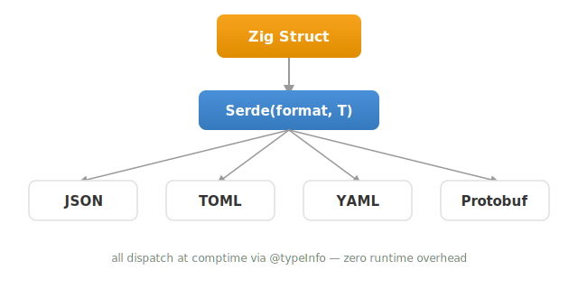

# comptime-serde


[](https://github.com/jiacai2050/comptime-serde/actions/workflows/ci.yml)

> Compile-time serialization and deserialization for Zig.

Define your struct once, automatically serialize/deserialize across JSON, TOML, YAML, and Protobuf — zero runtime overhead, all type dispatch happens at comptime via `@typeInfo`.

<picture>
  <source media="(prefers-color-scheme: dark)" srcset="docs/src/architecture-dark.svg">
  
</picture>

## Installation

```bash
# Latest version
zig fetch --save git+https://github.com/jiacai2050/comptime-serde.git
# Tagged version
zig fetch --save git+https://github.com/jiacai2050/comptime-serde.git#v0.2.0
```

```zig
// build.zig
const serde_dep = b.dependency("comptime_serde", .{});
exe.root_module.addImport("comptime_serde", serde_dep.module("comptime_serde"));
```

## Quick example

```zig
const serde = @import("comptime_serde");

const User = struct {
    name: []const u8,
    age: u32,
};

const json = serde.Serde(.json, User);

var buf: [512]u8 = undefined;
var writer = std.Io.Writer.fixed(&buf);
try json.serialize(&writer, .{ .name = "alice", .age = 30 });
// {"name":"alice","age":30}

var result = try json.deserialize(allocator, "{\"name\":\"alice\",\"age\":30}");
defer result.deinit();
// result.value is a User
```

## serde-gen CLI

```bash
curl -fsSL https://jiacai2050.github.io/comptime-serde/install.sh | sh
```

Infers Zig struct definitions from JSON/TOML/YAML files:

```bash
serde-gen config.json
```

## Documentation

- User guide: [jiacai2050.github.io/comptime-serde](https://jiacai2050.github.io/comptime-serde/)
- API reference: [jiacai2050.github.io/comptime-serde/apidocs](https://jiacai2050.github.io/comptime-serde/apidocs)

## License

MIT
